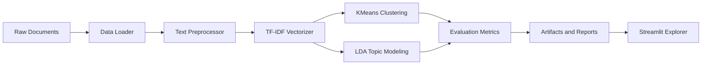

# Document Clustering and Topic Modeling

Unsupervised NLP pipeline for grouping documents, extracting interpretable topics, evaluating cluster quality, and exploring results through a Streamlit app.

## Live Demo

- Streamlit demo: https://document-clustering-topic-modeling-fckmphgfctfun5zxdxuor3.streamlit.app/
- Local app: `streamlit run app/streamlit_app.py`

## Problem

Teams often receive large sets of unstructured text such as customer feedback, research notes, tickets, or articles. Before labeling or building supervised models, they need a way to discover themes, inspect clusters, and understand whether the grouping is meaningful.

## Features

- Text loading from local document folders.
- Configurable preprocessing with stopword removal and lemmatization.
- TF-IDF vectorization.
- KMeans clustering.
- LDA topic modeling.
- Evaluation with silhouette score, Davies-Bouldin score, inertia, and cluster distribution.
- Visualization utilities for cluster exploration.
- Streamlit app for interactive analysis.
- Modular `src/` package with tests and scripts.

## Architecture



## Tech Stack

| Layer | Tools |
| --- | --- |
| ML/NLP | scikit-learn, NLTK, spaCy, TF-IDF, KMeans, LDA |
| App | Streamlit |
| Data | Local text files under `data/sample` |
| Quality | Pytest, Ruff, Black |
| Deployment | Streamlit Community Cloud, Docker |

## Project Structure

```text
document-clustering-topic-modeling/
├── app/                  # Streamlit app
├── data/sample/          # Small reproducible sample corpus
├── scripts/              # train, evaluate, predict, data utilities
├── src/                  # modular pipeline package
│   ├── data/
│   ├── evaluation/
│   ├── features/
│   ├── models/
│   ├── pipeline/
│   ├── preprocessing/
│   └── visualization/
├── tests/                # unit tests
├── MODEL_CARD.md
├── DEPLOYMENT.md
└── Makefile
```

## Setup

```bash
python -m venv .venv
source .venv/bin/activate
pip install -r requirements.txt
cp .env.example .env
```

Install NLTK resources:

```bash
python -m nltk.downloader punkt stopwords wordnet averaged_perceptron_tagger
```

## Environment Variables

`.env.example` documents optional settings for data paths, preprocessing, vectorization, clustering, topic modeling, and logging.

Important variables:

| Variable | Purpose |
| --- | --- |
| `DATA_INPUT_DIR` | Folder containing text files |
| `DATA_OUTPUT_DIR` | Artifact/report output folder |
| `VECTORIZER_MAX_FEATURES` | TF-IDF feature limit |
| `CLUSTERING_N_CLUSTERS` | Number of KMeans clusters |
| `TOPIC_N_TOPICS` | Number of LDA topics |

## Usage

Train the pipeline:

```bash
python scripts/train.py --data-dir data/sample --n-clusters 5 --n-topics 5
```

Evaluate saved artifacts:

```bash
python scripts/evaluate.py --artifact-dir artifacts --output artifacts/reports/evaluation_report.txt
```

Run the Streamlit app:

```bash
streamlit run app/streamlit_app.py
```

Run tests:

```bash
pytest tests -q
```

## ML Approach

1. Load plain-text documents.
2. Normalize and preprocess text.
3. Convert documents into TF-IDF vectors.
4. Cluster vectors with KMeans.
5. Extract topic terms with LDA.
6. Evaluate cluster quality and save artifacts.
7. Use the Streamlit app to inspect clusters, topics, and visualizations.

## Evaluation

This is an unsupervised project, so evaluation focuses on structure and interpretability:

- Silhouette score: higher means better cluster separation.
- Davies-Bouldin score: lower means more compact and separated clusters.
- Inertia: lower means tighter clusters, but must be balanced against over-clustering.
- Cluster distribution: helps identify collapsed or highly imbalanced cluster assignments.
- Topic terms: manually inspect whether topics are coherent and useful.

See `MODEL_CARD.md` for limitations and appropriate use.

## Screenshots

Screenshots should be added after the next deployed UI refresh:

- `docs/screenshots/streamlit-overview.png`
- `docs/screenshots/cluster-explorer.png`
- `docs/screenshots/topic-summary.png`

## Deployment

Use Streamlit Community Cloud for the public demo. Docker is available for local or platform-hosted deployment.

See `DEPLOYMENT.md` for exact steps.

## Roadmap

- Add screenshots from the live Streamlit deployment.
- Add BERTopic or sentence-transformer embeddings as an optional advanced pipeline.
- Add saved HTML/PDF evaluation reports.
- Add dataset upload support in the UI.

## Author

Yash Sharma - MCA AI/ML student focused on NLP, ML systems, GenAI, and backend AI services.
